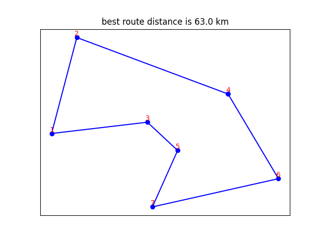

# Genetic Algorithm For TSP

## Description
Genetic Algorithm solution to Traveling-Salesman-Problem.

in this specific problem we have 7 nodes in partially connected graph. And want to find minimum cost path to visit all nodes and return to starting node.
## Getting Started
### Dependencies
Install dependencies by running following command:
\
```pip install -r requirements.txt```
### Executing

```python TSP.py```

### Result
Here is final result and table of accuracy for recovering noisy images.
\


### Authors
Amir Rezaei [@ameerezae](https://github.com/ameerezae)